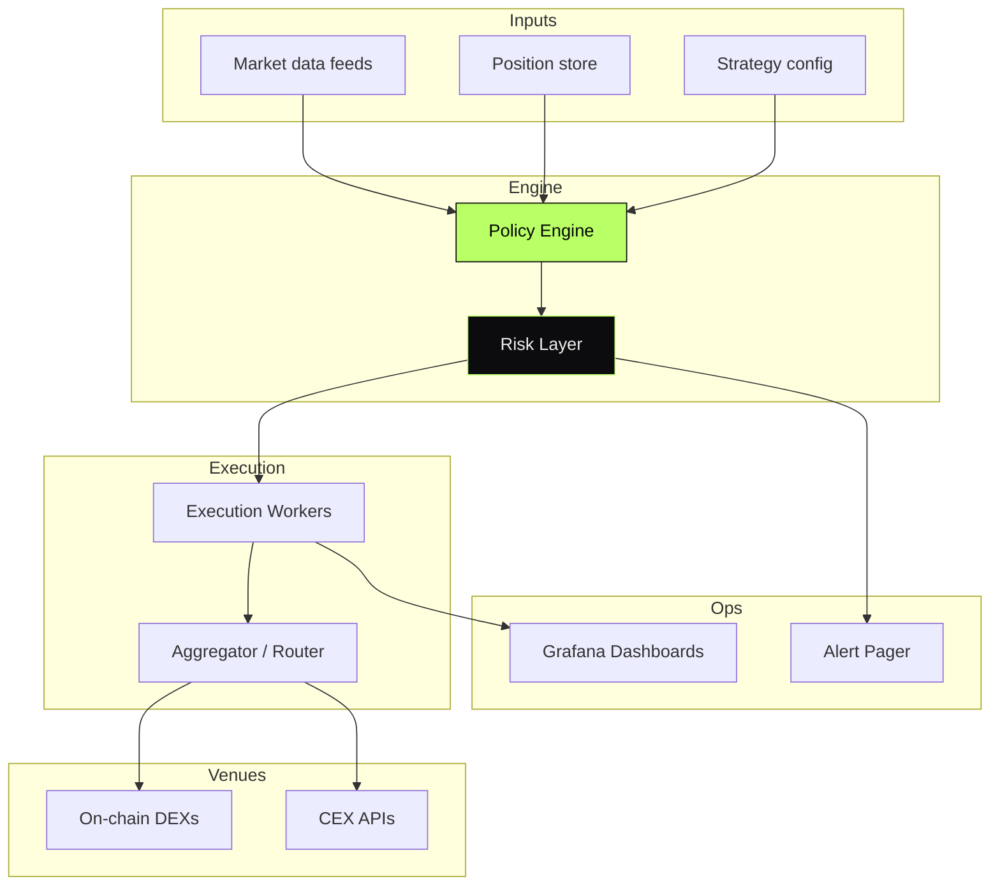

<div align="center">

```
   ███╗   ███╗███╗   ███╗     ██╗███╗   ██╗███████╗██████╗  █████╗
   ████╗ ████║████╗ ████║     ██║████╗  ██║██╔════╝██╔══██╗██╔══██╗
   ██╔████╔██║██╔████╔██║     ██║██╔██╗ ██║█████╗  ██████╔╝███████║
   ██║╚██╔╝██║██║╚██╔╝██║     ██║██║╚██╗██║██╔══╝  ██╔══██╗██╔══██║
   ██║ ╚═╝ ██║██║ ╚═╝ ██║     ██║██║ ╚████║██║     ██║  ██║██║  ██║
   ╚═╝     ╚═╝╚═╝     ╚═╝     ╚═╝╚═╝  ╚═══╝╚═╝     ╚═╝  ╚═╝╚═╝  ╚═╝
```

# Production Market-Making Infrastructure

#### Live MM systems for **WeWay** and **Hippo CTO**.
#### Orderbook ops, inventory & risk controls, alerting — the kind of system normally found inside quant funds.

[](#)
[](#)
[](#)
[](#)

</div>

---

> **TL;DR** — Production market-making infrastructure I designed and led from
> a blank repo to live capital deployment. Order placement, inventory tracking,
> risk controls, observability — all running 24/7 on real markets.

---

## Overview

Market-making infrastructure used to provide liquidity for tokens launched
by WeWay and the Hippo CTO program. The system places and cancels orders
across multiple venues, tracks inventory and exposure, enforces risk rules,
and pages operators when reality diverges from policy.

The system runs as a small fleet of cooperating services around a central
**policy engine** that turns market state into intents and intents into
on-chain or exchange API calls.

> This repository documents the system at the **architectural level**.
> Implementation code is private.

---

## My Role

> **Architect & Lead Engineer.**
> Owned every load-bearing decision in the system.

- System architecture and service decomposition
- Policy engine design (market state → intents → executions)
- Risk model — inventory limits, exposure caps, kill-switches
- Execution layer — on-chain swaps and exchange API integrations
- Observability — every decision is logged, every divergence pages

---

## Architecture



---

## System Components

| Component | Responsibility | Stack |
|---|---|---|
| **Policy Engine** | Turn market state into intents (place / cancel / hedge) | Node.js · TypeScript |
| **Risk Layer** | Enforce inventory, exposure, daily loss limits before any execution | TypeScript |
| **Execution Workers** | Carry out intents idempotently across venues | Node.js · BullMQ |
| **Position Store** | Authoritative inventory and PnL state | PostgreSQL |
| **Aggregator / Router** | Route execution across DEXs and CEX APIs | TypeScript |
| **Dashboards / Alerts** | Live ops view, divergence pager | Grafana · Prometheus · Loki |

---

## Capabilities

- **Multi-venue execution** — DEX (Solana, EVM) + CEX APIs from one engine
- **Inventory & exposure caps** — hard stops the operator cannot bypass without an audit trail
- **Daily-loss kill-switch** — auto-pause on PnL excursion
- **Strategy hot-reload** — config updates without restart
- **Operator dashboards** — live Grafana boards for inventory, fills, divergence
- **Audit log** — every intent and execution preserved for forensics

---

## Architectural Decisions & Tradeoffs

### 1. Policy engine is pure, execution is dirty

The policy engine is a **pure function** of (market state, position, config).
Side effects live behind it in execution workers. Result: I can replay a day
of market data against a new strategy without touching a wallet.

### 2. Risk layer has veto authority

The risk layer can reject any intent. It is the **last line of defense**
before any chain or exchange call. No execution path bypasses it.

### 3. Idempotent execution by design

Every execution carries a deterministic key. Workers can retry safely; the
venue layer dedupes by key. No accidental double-orders during retries.

### 4. Observability is not optional

Every intent, decision, and execution writes structured logs and metrics.
Grafana boards mirror the system's own internal state. If something
diverges, we see it within seconds, not minutes.

---

## Engineering Invariants

- **Never** execute without passing risk
- **Never** mutate inventory outside the position store
- **Never** trust a venue ack — confirm with reconciliation
- **Never** silently retry an order — log, audit, decide
- **Never** ship a strategy without a corresponding kill-switch

---

## Related Public Documents

- [`weway-launchpad`](https://github.com/eldardzh/weway-launchpad) — launchpad ecosystem MM operates alongside
- [`sundog`](https://github.com/eldardzh/sundog) — companion Solana product
- [`grafana-observability-stack`](https://github.com/eldardzh/grafana-observability-stack) — observability layer
- [`trading-systems-toolkit`](https://github.com/eldardzh/trading-systems-toolkit) — simulator / backtest tooling

---

<div align="center">

#### **Contact**
[**eldardzh.com**](https://eldardzh.com) · [**@EldarDissmay**](https://x.com/EldarDissmay) · **dissmay21@gmail.com**

<sub>© 2026 · Eldar D. · Built 2024 — 2025.</sub>

</div>
